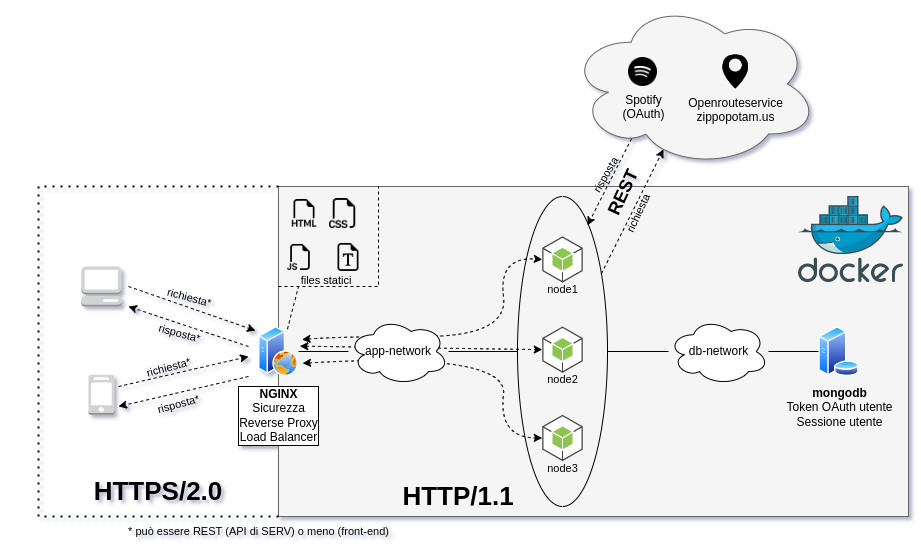
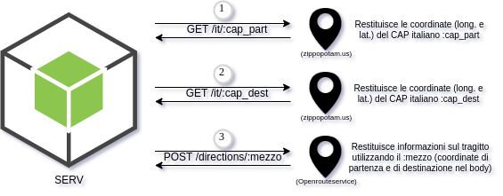
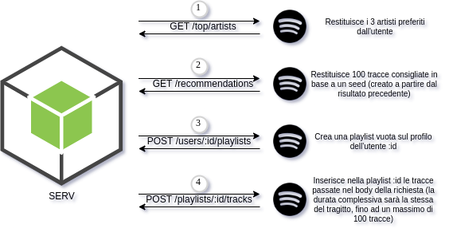

# Daily Trip Enhancer
## Scopo del progetto
Stanco del solito viaggio giornaliero da/verso la scuola o il lavoro? Con Daily Trip Enhancer potrai mettere fine alla noia con una playlist personalizzata e dalla durata perfetta per ogni tuo viaggio, e se ti sposti con i mezzi pubblici o a piedi potrai anche fare nuove amicizie attraverso la chat!
## Architettura di riferimento

## Tecnologie usate
### [Docker/Docker Compose (**Requisito 6**)](https://www.docker.com/)
Costruiscono ed avviano la seguente architettura:
- #### [NGINX](https://www.nginx.com/)
  - *Sicurezza* (**Requisito 9**): parla **solo** HTTPS/2 con l'esterno, aggiorna da connessioni HTTP a HTTPS, usa certificato self-signed con scambio di chiavi Diffie-Hellman 
  - Parla HTTP/1.1 con *SERV*
  - *Gestione del traffico*: reverse proxy (con load balancing)
  - Server per i file statici (css, fonts, scripts)
- #### [Node.js](https://nodejs.org/)
  - 3 istanze
  - Librerie utilizzate per SERV: **express** (HTTP), **passport** (OAuth), **socket.io** (WebSocket)
  - Librerie utilizzate per i test: **mocha** con assertion library **chai**
- #### [MongoDB](https://www.mongodb.com/)
  - Sessioni degli utenti
  - Memorizzazione token OAuth degli utenti
- #### [RabbitMQ](https://www.rabbitmq.com/)
  - Le WebSocket che girano sulle 3 diverse istanze dell'app non sono sincronizzate fra loro
  - RabbitMQ garantisce la sincronizzazione delle WebSocket (**Requisito 5**), e quindi della chat su tutti i nodi
  - Per la comunicazione si utilizza il protocollo AMQP (**Requisito 5**)
### [GitHub e GitHub Actions (**Requisiti 7 e 8**)](https://github.com/features/actions)
Il progetto è disponibile su **GitHub**, che è stato utilizzato per facilitare lo sviluppo e la coordinazione tra i membri del gruppo (**Requisito 7**)

Per la CI/CD sono state utilizzate le **GitHub Actions**: partono automaticamente i test di SERV (effettuati con Mocha) dopo ogni push o pull request in master (**Requisito 8**)

## Servizi REST
### Utilizzati da *SERV* (**Requisiti 2, 3 e 4**)


### Offerti da *SERV* (**Requisito 1**)
- Distanza del tragitto fra due CAP specificando un mezzo di trasporto
- Durata del tragitto fra due CAP specificando un mezzo di trasporto

La documentazione delle API è disponibile qui: [apidoc](https://infiniteez.github.io/progettorc/app/doc/)
## Istruzioni per l'installazione (**Requisito 6**)
```console
git clone https://github.com/Infiniteez/progettorc.git
cd progettorc
docker compose build
```
## Istruzioni per l'avvio (**Requisito 6**)
```console
docker compose up
```
## Istruzioni per il test (**Requisito 6**)
```console
cd app
npm install && npm test
```

#
Questo README documenta il progetto come richiesto nel **Requisito 7**

Per consultare tutti i requisiti fare riferimento a [questa](https://pastebin.com/raw/2D5iNNjg) pagina