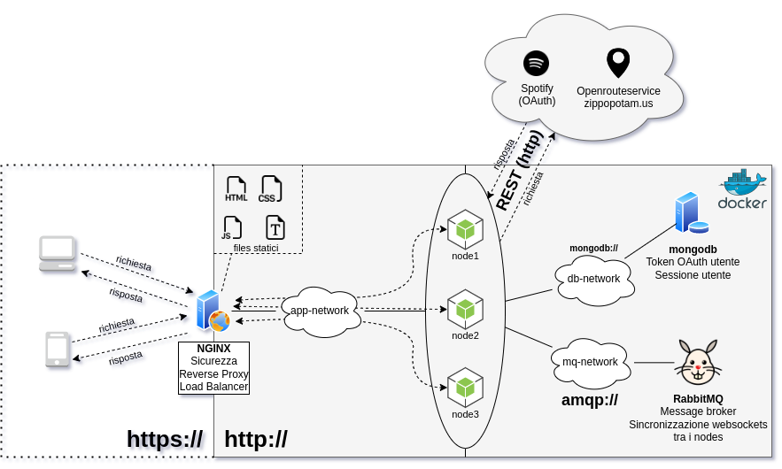

# TODO: aggiungere titolo progetto
## Scopo del progetto
TODO: aggiungere scopo del progetto
## Architettura di riferimento

## Tecnologie usate
### [Docker (compose)](https://www.docker.com/)
Costruisce ed avvia la seguente architettura
#### [NGINX](https://www.nginx.com/)
- *Sicurezza*: parla **solo** HTTPS/2 con l'esterno, aggiorna da connessioni HTTP a HTTPS, usa certificato self-signed con scambio di chiavi Diffie-Hellman
- Parla HTTP/1.1 con *SERV*
- *Gestione del traffico*: reverse proxy (con load balancing)
- Server per i file statici (css, fonts, scripts)
#### [Node.js](https://nodejs.org/)
- Librerie utilizzate per SERV: **express** (HTTP), **passport** (OAuth)
- Librerie utilizzate per i test: **mocha** con assertion library **chai**
#### [MongoDB](https://www.mongodb.com/)
- Sessioni degli utenti
- Memorizzazione token OAuth degli utenti
### [GitHub Actions](https://github.com/features/actions)
CI/CD, vengono effettuati i test con Mocha dopo ogni push

## Servizi REST
### Utilizzati da *SERV*
#### Commerciali
- [Spotify (OAuth)](https://developer.spotify.com/)
#### Non commerciali
- [zippopotam.us](https://www.zippopotam.us/)
- [Openrouteservice](https://openrouteservice.org/)
### Offerti da *SERV*
TODO: aggiungere con apidoc
## Installazione
```console
docker compose build
```
## Avvio
```console
docker compose up
```
## Test
```console
npm install
npm test
```